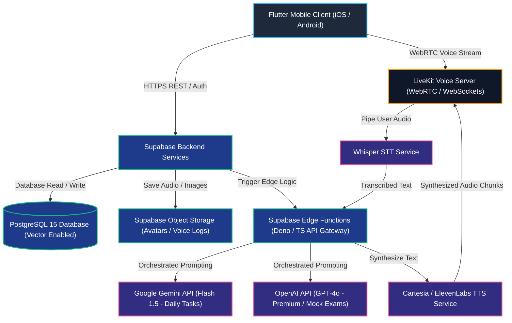
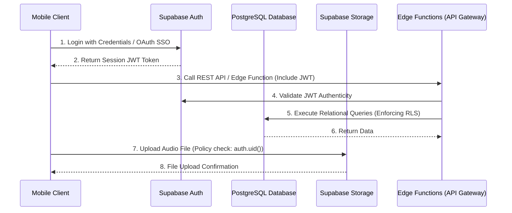
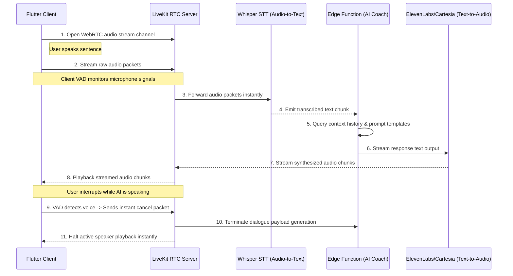

# Software System Architecture Document: AI Language Coach
**Version:** 1.0  
**Status:** Draft  
**Author:** Robin R G  
**Last Updated:** July 2026  

---

## 1. Purpose
This document defines the comprehensive software architecture for the **AI Language Coach** mobile platform. It acts as the primary design blueprint for system architects, cloud engineers, mobile developers, and security inspectors. 

The architecture is designed to guarantee high modularity, scalability up to 1M+ active learners, low-latency audio communications, multi-tier data security, and decoupling from specific AI providers.

---

## 2. High-Level Architecture

The platform uses a cloud-native, microservices-friendly topology separating user interactions, backend operations, database layers, voice channels, and AI service providers.



### Strategic Component Responsibilities:
1.  **Flutter Mobile Client:** Renders UI layouts, handles local secure session tokens, captures audio packets, and processes local database sync structures.
2.  **LiveKit Voice Server:** Orchestrates ultra-low latency WebRTC voice connections and WebSockets session channels between client devices and TTS/STT services.
3.  **Supabase Cloud Backend:** Acts as the backend core, providing JWT user session authentication, cloud object storage, and PostgreSQL databases.
4.  **Supabase Edge Functions (AI Gateway):** Decouples client applications from raw AI APIs. Standardizes prompt templates, executes RAG context operations, sanitizes inputs, and handles external LLM execution.
5.  **AI Provider Tier:** Services translation, grammar, pronunciation, and dialogue requests based on complexity and cost models.

---

## 3. Client Architecture (Flutter)

The Flutter mobile application conforms strictly to **Clean Architecture** rules, dividing features into modular slices to prevent dependency leaks.

```
+-------------------------------------------------------------------------------+
| PRESENTATION LAYER (UI Widgets, Screens, Riverpod Controllers)                |
+------------------------------------+------------------------------------------+
| APPLICATION LAYER (UseCase coordinates feature business actions)               |
+------------------------------------+------------------------------------------+
| DOMAIN LAYER (Business Entities, Repository Interfaces - Zero Outer Dep)      |
+------------------------------------+------------------------------------------+
| DATA LAYER (Models, local/remote DataSources, Repository Implementations)    |
+------------------------------------+------------------------------------------+
| INFRASTRUCTURE LAYER (LiveKit client, Supabase client SDKs, Hive caches)      |
+------------------------------------+------------------------------------------+
```

### State Management Lifecycle (Riverpod):
*   **State Notifier Controllers:** Observe repository streams, map responses to immutable states, and bind states to the UI.
*   **AsyncNotifier Generator:** Simplifies the execution of asynchronous actions. Exposes `AsyncLoading()`, `AsyncData()`, and `AsyncError()` states directly to presentation builders.
*   **Decoupled Widgets:** Widgets are lightweight and presentation-only. They never query database instances or API gateways directly.

---

## 4. Backend Services (Supabase Core)



### Backend Components:
*   **Authentication Service:** Manages user registrations, Email OTP logs, and Google/Apple SSO key validations.
*   **PostgreSQL 15 Database:** Structured storage with active Row-Level Security (RLS) policies. Enforces strict transactional integrity.
*   **Supabase Storage:** Hosts binary assets (user profiles, voice recordings, certificates). Access is governed by RLS guidelines matching user UUIDs.
*   **Edge Functions Gateway:** Lightweight, stateless TypeScript instances that orchestrate API prompts, verify purchases, and process payment gateway webhooks.

---

## 5. AI Service Layer Gateway

Mobile applications must never connect directly to third-party AI APIs. AI connections are routed through **Supabase Edge Functions**, which serve as an AI Gateway:

```
  [Flutter Client Application]
               |
               | (HTTPS Post: request_payload + JWT)
               v
  [Supabase Edge Function (AI Gateway Router)]
               |
               +---> [JWT Validate & RLS check]
               +---> [Load Prompt Template from version cache]
               +---> [Fetch Context from Vector Memory Database]
               +---> [Format prompt text payloads]
               |
               v
  [AI Provider (Gemini / OpenAI API)]
```

### Gateway Advantages:
*   **Secret Protection:** AI credentials and authorization headers remain hidden inside backend environment secrets.
*   **Dynamic Prompt Auditing:** Prompts are updated and audited on the backend, removing the need to push app store updates for minor language model changes.
*   **Provider Switching (Failover):** If OpenAI returns a 503 error, the Gateway automatically reroutes the task to Gemini.
*   **Content Moderation:** Outgoing requests are sanitized to prevent jailbreaks, and incoming text is checked to filter toxic outputs.

---

## 6. AI Provider Strategy

The system splits tasks dynamically to balance latency, cost, and analytical depth:

```
+-----------------------------------+-----------------------------------+---------------------------+
| WORKLOAD FEATURE                  | PRIMARY AI PROVIDER MODEL         | ARCHITECTURAL RATIONALE   |
+-----------------------------------+-----------------------------------+---------------------------+
| Translation & Simple Scaffolding  | Gemini 1.5 Flash                  | Low cost, sub-second      |
|                                   |                                   | latency, large context    |
+-----------------------------------+-----------------------------------+---------------------------+
| Core Grammar Correction Cards     | Gemini 1.5 Flash                  | Structured JSON schema    |
|                                   |                                   | parsing output support    |
+-----------------------------------+-----------------------------------+---------------------------+
| Standard Vocabulary Builder       | Gemini 1.5 Flash                  | Highly cost-effective     |
+-----------------------------------+-----------------------------------+---------------------------+
| Timed IELTS Speaking Simulations  | OpenAI GPT-4o-mini                | Low latency conversation, |
|                                   |                                   | strict dialogue flow      |
+-----------------------------------+-----------------------------------+---------------------------+
| Essay writing evaluations         | OpenAI GPT-4o (or Claude 3.5)     | High reasoning accuracy,  |
|                                   |                                   | standardized scoring      |
+-----------------------------------+-----------------------------------+---------------------------+
| Pronunciation Clarity Diagnoses   | Whisper Audio API + Custom Agent   | Phoneme-level diagnostics |
+-----------------------------------+-----------------------------------+---------------------------+
```

---

## 7. Real-Time Voice Pipeline Architecture

The voice conversation pipeline uses **LiveKit** to establish ultra-low latency WebRTC audio streams:



### Voice Activity Detection (VAD) Controls:
The client application runs local VAD metrics. When input signals exceed active decibel baselines, the client triggers a WebSockets interruption packet. This halts synthesized playback immediately, preventing overlapping audio.

---

## 8. Authentication & JWT Life Cycle

1.  **SSO Key Handshake:** The client contacts Google/Apple SSO to obtain a secure identity token.
2.  **JWT Verification:** The identity token is submitted to Supabase Auth, which returns a secure access JWT and a refresh token.
3.  **Local Encryption:** The refresh token is saved securely in the device's Keychain (iOS) or Keystore (Android) using **Flutter Secure Storage**.
4.  **Database Gateway Gating:** The access JWT is added to all REST request headers. PostgreSQL inspects the token, decodes the user UUID, and applies Row-Level Security rules before returning data.

---

## 9. Database Isolation & Repositories

To enforce clean separation, UI widgets cannot directly call the Supabase client SDK. They must access abstract repository interfaces:

```
  [UI ChatScreen Widget]
           |
           | (Calls ChatController notifier method)
           v
  [ChatController Notifier]
           |
           | (Calls ChatRepository.sendMessage interface)
           v
  [ChatRepositoryImpl (Fulfills Domain contract)]
           |
           +---> Queries ChatRemoteDataSource (calls Supabase REST Edge APIs)
           +---> Queries ChatLocalDataSource (Hive database local cache queries)
```

---

## 10. Client-Side Caching Strategy

The client application caches key resources locally using **Hive** (or **Isar**) to minimize network traffic and API requests:

```
+-----------------------------------+-----------------------------------+---------------------------+
| CACHE CATEGORY                    | DATABASE STORE                    | INVALIDATION RULE         |
+-----------------------------------+-----------------------------------+---------------------------+
| Active Profile Settings           | Hive Secure Box                   | Upon manual change or     |
|                                   |                                   | user log out              |
+-----------------------------------+-----------------------------------+---------------------------+
| Vocabulary SRS queues             | Hive Standard Box                 | Syncs daily with Supabase |
|                                   |                                   | PostgreSQL database       |
+-----------------------------------+-----------------------------------+---------------------------+
| Daily Lessons Catalog             | Hive Standard Box                 | Wiped and updated weekly  |
+-----------------------------------+-----------------------------------+---------------------------+
| Historical Grammar Corrections    | Hive Standard Box                 | Invalidated every 48 hours|
+-----------------------------------+-----------------------------------+---------------------------+
```

---

## 11. Offline Operations & Sync Reconciliation

AI Language Coach uses an **Offline-First** model for text-based study features.

```
  [User completes Offline Vocabulary Drill]
                   |
                   v
  [Write updates to Hive Local Cache] ---> [Queue sync task in Hive Sync Queue]
                   |
                   v
  [Network Monitor detects Offline State] ---> (Idle / Wait)
                   |
                   v
  [Network Monitor detects Online State]
                   |
                   v
  [Background Sync Engine processes queue elements sequentially]
                   |
                   v
  [HTTPS REST payload updates Supabase PostgreSQL DB]
                   |
                   v
  [Wipe items from Hive Sync Queue upon successful sync confirmation]
```

---

## 12. Notification Pipeline

1.  **Edge Trigger:** A daily background job inside Supabase monitors active study streaks.
2.  **Alert Queue:** If a user has not completed their daily goal by 7:00 PM local time, the database flags a notification event.
3.  **FCM Dispatch:** Supabase Edge Functions send a push notification payload to the **Firebase Cloud Messaging** endpoint.
4.  **Client UI Handling:** FCM delivers the message payload to the device. Clicking the alert launches GoRouter to load the daily study screen.

---

## 13. Telemetry & Analytics Flow

```
  [User starts Mock Exam]
            |
            v
  [AnalyticsService.logEvent('mock_exam_started')]
            |
            v
  [Local Diagnostic Console] ---> (Pipes events to Firebase Analytics SDK)
                                            |
                                            v
                               [Firebase Cloud Console]
                                            |
                                            v
                                 [Product metrics Dash]
```

*   **Standard Events:** Track logins, speaking durations, grammar review openings, and subscription purchases.
*   **Privacy Guard:** User email addresses, names, and transcript texts are stripped from analytics payloads to preserve privacy.

---

## 14. Data Security Architecture

*   **Encryption In-Transit:** All APIs, LiveKit channels, and database connections require TLS 1.3 encryption.
*   **Encryption At-Rest:** Supabase PostgreSQL databases use AES-256 transparent data encryption at the storage block layer.
*   **Row-Level Security Policies:** RLS is active on all tables.
    ```sql
    -- Example RLS Policy for Grammar Errors table
    CREATE POLICY "Users can only view their own errors" 
    ON grammar_errors 
    FOR SELECT 
    USING (auth.uid() = user_id);
    ```

---

## 15. System Error & Failover Management

*   **AI Service Outages:** If OpenAI returns a rate-limit error (HTTP 429) or is unavailable (HTTP 503), the AI Gateway Edge Function automatically redirects the request to Google Gemini.
*   **Voice Disconnections:** If a WebRTC socket drops during a call, the LiveKit SDK enters a reconnect state. The UI displays a warning while keeping the audio session active in the background.
*   **TTS Fallbacks:** If the primary TTS API fails, the application dynamically falls back to the device's native system Text-to-Speech library.

---

## 16. Deployment Pipelines

*   **Mobile App Distributions:** Compiled using Flutter CLI pipelines. Automated builds are uploaded to **Google Play Console** and **Apple App Store Connect** via **Fastlane** runners in GitHub Actions.
*   **Backend Deployment:** Supabase configurations, database schema changes, and edge functions are version-controlled and pushed via the **Supabase CLI** pipeline.
*   **LiveKit Voice Nodes:** Deployed to LiveKit Cloud for automated horizontal scaling and global edge network routing.

---

## 17. Horizontal Scalability Targets

The system scales across three distinct development phases:

```
+-----------------------------------+-----------------------------------+---------------------------+
| PHASE STAGE                       | CONCURRENT VOICE SESSIONS         | DATABASE SCALABILITY      |
+-----------------------------------+-----------------------------------+---------------------------+
| Phase 1: Launch (<10k Users)      | Up to 100 concurrent streams      | Single Supabase PostgreSQL|
|                                   |                                   | instance                  |
+-----------------------------------+-----------------------------------+---------------------------+
| Phase 2: Growth (<100k Users)     | Up to 1,000 concurrent streams    | Enforce read-replicas,    |
|                                   |                                   | indexed search optimization|
+-----------------------------------+-----------------------------------+---------------------------+
| Phase 3: Scale (1M+ Users)        | 10,000+ concurrent streams        | Sharded databases, PGPool |
|                                   |                                   | connection management     |
+-----------------------------------+-----------------------------------+---------------------------+
```

---

## 18. Monitoring & Telemetry

*   **Performance Dashboards:** Log API transaction times, Voice WebRTC latency, and Whisper processing speeds in Firebase.
*   **System Alert Thresholds:** Set alerts to notify the team if:
    *   API response latency exceeds 3 seconds.
    *   App crash rates exceed 0.5% of daily active users.
    *   LiveKit voice connection drops exceed 3% of active sessions.

---

## 19. Disaster Recovery (DR)

*   **Backup Cadence:** The database runs full backups every 24 hours. Supabase Storage assets (profiles and voice files) run full backups weekly.
*   **Recovery SLA:** Target Recovery Point Objective (RPO) is 24 hours. Recovery Time Objective (RTO) is under 2 hours, utilizing Supabase's point-in-time recovery tools.

---

## 20. Future Architectural Considerations

*   **Institutional Dashboards:** Build a standalone web application (compiled via Flutter Web) that connects to B2B dashboard APIs. This will allow teachers to view progress metrics for entire classes.
*   **On-Device AI Models:** As mobile hardware improves, integrate light, local ONNX voice processors on the device to enable basic voice chat offline.
*   **Multi-Region Backend Routing:** Set up distributed Supabase databases in Europe, North America, and Asia to minimize database query latency.

---

## 21. Core Architecture Principles

*   **Clean Separation of Concerns:** Decouple Presentation, Domain, and Data layers.
*   **Cloud-Native & Serverless:** Minimize server maintenance overhead by using Supabase Edge Functions.
*   **API Agnosticism:** Keep client models decoupled from specific LLM vendors through the AI Gateway.
*   **Security by Design:** Enforce RLS database rules and JWT authorization across all services.
*   **Offline-Ready:** Allow core study features to run without an active network connection.

---

## 22. System Architecture Checklist

Ensure these checklist items are verified before production deployment:
*   [ ] Is PostgreSQL Row-Level Security active on all tables?
*   [ ] Are API keys and AI credentials hidden from the client code?
*   [ ] Have LiveKit latency benchmarks been verified under simulated slow network conditions?
*   [ ] Are daily database backups active?
*   [ ] Has GDPR cascading erasure logic been validated?
*   [ ] Does the CI/CD pipeline pass formatting, analysis, and build checks for both Android and iOS?
