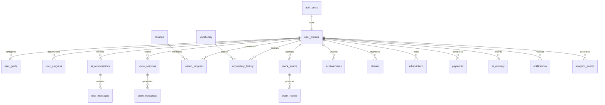

# Database Schema & ERD Document: AI Language Coach
**Version:** 1.0  
**Status:** Draft  
**Database System:** PostgreSQL 15 (hosted via Supabase)  
**Last Updated:** July 2026  

---

## 1. Purpose
This document defines the physical database schema, entity-relationship model, indexing strategy, soft delete architecture, and Row-Level Security (RLS) configurations for **AI Language Coach**. 

It ensures a highly scalable, secure, and normalized PostgreSQL database design optimized for Supabase Edge Functions and real-time operations.

---

## 2. Relational Database Overview
*   **Hosting Platform:** Supabase (PostgreSQL 15).
*   **Core Schema Domains:** User Authentication, Profile Configuration, Interactive Study, Speech analytics, Mock Exams, Gamification Loops, Payments, and RAG Memory.

---

## 3. High-Level Entity Relationship Diagram (ERD)

This diagram outlines the complete relational data model:



---

## 4. Core Table Definitions

### 4.1 auth.users (Supabase Native Schema)
*   **Description:** Core user registration details managed natively in the `auth` schema by Supabase.
*   **PrimaryKey:** `id` (UUID)

### 4.2 user_profiles
*   **Description:** User preferences and target exam parameters.
*   **Columns:**
    *   `id` `UUID PRIMARY KEY DEFAULT gen_random_uuid()`
    *   `auth_user_id` `UUID REFERENCES auth.users(id) ON DELETE CASCADE UNIQUE`
    *   `full_name` `VARCHAR(255) NOT NULL`
    *   `avatar_url` `TEXT`
    *   `native_language` `VARCHAR(50) NOT NULL`
    *   `target_language` `VARCHAR(50) NOT NULL`
    *   `proficiency_level` `VARCHAR(10) NOT NULL`
    *   `target_exam` `VARCHAR(50) NOT NULL`
    *   `timezone` `VARCHAR(100) DEFAULT 'UTC'`
    *   `onboarding_completed` `BOOLEAN DEFAULT false`
    *   `created_at` `TIMESTAMPTZ DEFAULT now()`
    *   `updated_at` `TIMESTAMPTZ DEFAULT now()`
    *   `deleted_at` `TIMESTAMPTZ DEFAULT null`

### 4.3 user_goals
*   **Description:** Daily and weekly study duration targets.
*   **Columns:**
    *   `id` `UUID PRIMARY KEY DEFAULT gen_random_uuid()`
    *   `user_id` `UUID REFERENCES user_profiles(id) ON DELETE CASCADE`
    *   `daily_goal` `INTEGER DEFAULT 20`
    *   `weekly_goal` `INTEGER DEFAULT 140`
    *   `target_exam_score` `VARCHAR(20)`
    *   `reminder_time` `TIME`
    *   `created_at` `TIMESTAMPTZ DEFAULT now()`
    *   `deleted_at` `TIMESTAMPTZ DEFAULT null`

### 4.4 user_progress
*   **Description:** Cumulative experience points (XP) and language scores.
*   **Columns:**
    *   `id` `UUID PRIMARY KEY DEFAULT gen_random_uuid()`
    *   `user_id` `UUID REFERENCES user_profiles(id) ON DELETE CASCADE UNIQUE`
    *   `xp` `INTEGER DEFAULT 0`
    *   `level` `INTEGER DEFAULT 1`
    *   `grammar_score` `INTEGER DEFAULT 0`
    *   `speaking_score` `INTEGER DEFAULT 0`
    *   `writing_score` `INTEGER DEFAULT 0`
    *   `vocabulary_score` `INTEGER DEFAULT 0`
    *   `reading_score` `INTEGER DEFAULT 0`
    *   `listening_score` `INTEGER DEFAULT 0`
    *   `last_study_date` `DATE`

### 4.5 lessons
*   **Description:** Master educational content catalog.
*   **Columns:**
    *   `id` `UUID PRIMARY KEY DEFAULT gen_random_uuid()`
    *   `title` `VARCHAR(255) NOT NULL`
    *   `category` `VARCHAR(50) NOT NULL`
    *   `difficulty` `VARCHAR(10) NOT NULL`
    *   `language` `VARCHAR(50) NOT NULL`
    *   `estimated_minutes` `INTEGER NOT NULL`
    *   `deleted_at` `TIMESTAMPTZ DEFAULT null`

### 4.6 lesson_progress
*   **Description:** Tracks lesson attempts.
*   **Columns:**
    *   `id` `UUID PRIMARY KEY DEFAULT gen_random_uuid()`
    *   `user_id` `UUID REFERENCES user_profiles(id) ON DELETE CASCADE`
    *   `lesson_id` `UUID REFERENCES lessons(id) ON DELETE CASCADE`
    *   `started_at` `TIMESTAMPTZ DEFAULT now()`
    *   `completed_at` `TIMESTAMPTZ`
    *   `completion_percentage` `NUMERIC(5,2) DEFAULT 0.00`
    *   `earned_xp` `INTEGER DEFAULT 0`
    *   `mistakes` `JSONB`

### 4.7 vocabulary
*   **Description:** Core lexical items database dictionary.
*   **Columns:**
    *   `id` `UUID PRIMARY KEY DEFAULT gen_random_uuid()`
    *   `word` `VARCHAR(255) NOT NULL`
    *   `meaning` `TEXT NOT NULL`
    *   `pronunciation` `VARCHAR(255) NOT NULL`
    *   `examples` `TEXT[] NOT NULL`
    *   `cefr_level` `VARCHAR(10) NOT NULL`

### 4.8 vocabulary_history
*   **Description:** Spaced Repetition (SRS) interval parameters.
*   **Columns:**
    *   `id` `UUID PRIMARY KEY DEFAULT gen_random_uuid()`
    *   `user_id` `UUID REFERENCES user_profiles(id) ON DELETE CASCADE`
    *   `word_id` `UUID REFERENCES vocabulary(id) ON DELETE CASCADE`
    *   `mastery_level` `INTEGER DEFAULT 0`
    *   `review_count` `INTEGER DEFAULT 0`
    *   `next_review` `TIMESTAMPTZ DEFAULT now()`
    *   `last_reviewed` `TIMESTAMPTZ`

### 4.9 ai_conversations
*   **Description:** Active or historical chat sessions.
*   **Columns:**
    *   `id` `UUID PRIMARY KEY DEFAULT gen_random_uuid()`
    *   `user_id` `UUID REFERENCES user_profiles(id) ON DELETE CASCADE`
    *   `title` `VARCHAR(255) NOT NULL`
    *   `provider` `VARCHAR(50) NOT NULL`
    *   `model` `VARCHAR(50) NOT NULL`
    *   `started_at` `TIMESTAMPTZ DEFAULT now()`
    *   `updated_at` `TIMESTAMPTZ DEFAULT now()`
    *   `deleted_at` `TIMESTAMPTZ DEFAULT null`

### 4.10 chat_messages
*   **Description:** Individual turns in a chat conversation.
*   **Columns:**
    *   `id` `UUID PRIMARY KEY DEFAULT gen_random_uuid()`
    *   `conversation_id` `UUID REFERENCES ai_conversations(id) ON DELETE CASCADE`
    *   `role` `VARCHAR(10) NOT NULL`
    *   `content` `TEXT NOT NULL`
    *   `token_count` `INTEGER DEFAULT 0`
    *   `latency_ms` `INTEGER`
    *   `grammar_feedback` `JSONB`
    *   `translation` `TEXT`
    *   `timestamp` `TIMESTAMPTZ DEFAULT now()`

### 4.11 voice_sessions
*   **Description:** Latency metadata logged during voice call operations.
*   **Columns:**
    *   `id` `UUID PRIMARY KEY DEFAULT gen_random_uuid()`
    *   `user_id` `UUID REFERENCES user_profiles(id) ON DELETE CASCADE`
    *   `provider` `VARCHAR(50) NOT NULL`
    *   `duration` `INTEGER NOT NULL`
    *   `room_id` `VARCHAR(100) NOT NULL`
    *   `started_at` `TIMESTAMPTZ DEFAULT now()`
    *   `ended_at` `TIMESTAMPTZ`

### 4.12 voice_transcripts
*   **Description:** Text conversions of spoken dialogs.
*   **Columns:**
    *   `id` `UUID PRIMARY KEY DEFAULT gen_random_uuid()`
    *   `session_id` `UUID REFERENCES voice_sessions(id) ON DELETE CASCADE`
    *   `transcript` `TEXT NOT NULL`
    *   `ai_response` `TEXT NOT NULL`
    *   `pronunciation_score` `INTEGER`
    *   `fluency_score` `INTEGER`
    *   `created_at` `TIMESTAMPTZ DEFAULT now()`

### 4.13 mock_exams
*   **Description:** Attempt records for mock examinations.
*   **Columns:**
    *   `id` `UUID PRIMARY KEY DEFAULT gen_random_uuid()`
    *   `user_id` `UUID REFERENCES user_profiles(id) ON DELETE CASCADE`
    *   `exam_type` `VARCHAR(50) NOT NULL`
    *   `section` `VARCHAR(50) NOT NULL`
    *   `duration` `INTEGER NOT NULL`
    *   `started_at` `TIMESTAMPTZ DEFAULT now()`
    *   `completed_at` `TIMESTAMPTZ`

### 4.14 exam_results
*   **Description:** AI mock grades and scores.
*   **Columns:**
    *   `id` `UUID PRIMARY KEY DEFAULT gen_random_uuid()`
    *   `exam_id` `UUID REFERENCES mock_exams(id) ON DELETE CASCADE UNIQUE`
    *   `estimated_score` `VARCHAR(20) NOT NULL`
    *   `grammar_score` `INTEGER`
    *   `vocabulary_score` `INTEGER`
    *   `fluency_score` `INTEGER`
    *   `recommendations` `TEXT`
    *   `created_at` `TIMESTAMPTZ DEFAULT now()`

### 4.15 achievements
*   **Description:** Achievements progress and earned badges.
*   **Columns:**
    *   `id` `UUID PRIMARY KEY DEFAULT gen_random_uuid()`
    *   `user_id` `UUID REFERENCES user_profiles(id) ON DELETE CASCADE`
    *   `achievement_name` `VARCHAR(100) NOT NULL`
    *   `badge` `VARCHAR(255) NOT NULL`
    *   `unlocked_at` `TIMESTAMPTZ DEFAULT now()`
    *   `xp_reward` `INTEGER DEFAULT 0`

### 4.16 streaks
*   **Description:** User streak trackers.
*   **Columns:**
    *   `id` `UUID PRIMARY KEY DEFAULT gen_random_uuid()`
    *   `user_id` `UUID REFERENCES user_profiles(id) ON DELETE CASCADE UNIQUE`
    *   `current_streak` `INTEGER DEFAULT 0`
    *   `longest_streak` `INTEGER DEFAULT 0`
    *   `freeze_count` `INTEGER DEFAULT 0`
    *   `last_active_date` `DATE`

### 4.17 subscriptions
*   **Description:** Stripe payment and billing status records.
*   **Columns:**
    *   `id` `UUID PRIMARY KEY DEFAULT gen_random_uuid()`
    *   `user_id` `UUID REFERENCES user_profiles(id) ON DELETE CASCADE`
    *   `provider` `VARCHAR(50) NOT NULL`
    *   `plan` `VARCHAR(50) NOT NULL`
    *   `status` `VARCHAR(50) NOT NULL`
    *   `renewal_date` `TIMESTAMPTZ`
    *   `expires_at` `TIMESTAMPTZ`

### 4.18 payments
*   **Description:** Financial transactional history logs.
*   **Columns:**
    *   `id` `UUID PRIMARY KEY DEFAULT gen_random_uuid()`
    *   `user_id` `UUID REFERENCES user_profiles(id) ON DELETE CASCADE`
    *   `transaction_id` `VARCHAR(255) NOT NULL`
    *   `amount` `NUMERIC(10,2) NOT NULL`
    *   `currency` `VARCHAR(10) NOT NULL`
    *   `platform` `VARCHAR(50) NOT NULL`
    *   `status` `VARCHAR(50) NOT NULL`
    *   `created_at` `TIMESTAMPTZ DEFAULT now()`

### 4.19 ai_memory
*   **Description:** User preferences and weak skills parsed from transcripts.
*   **Columns:**
    *   `id` `UUID PRIMARY KEY DEFAULT gen_random_uuid()`
    *   `user_id` `UUID REFERENCES user_profiles(id) ON DELETE CASCADE`
    *   `memory_type` `VARCHAR(50) NOT NULL`
    *   `content` `TEXT NOT NULL`
    *   `importance` `INTEGER DEFAULT 1`
    *   `created_at` `TIMESTAMPTZ DEFAULT now()`

### 4.20 notifications
*   **Description:** Notification alerts.
*   **Columns:**
    *   `id` `UUID PRIMARY KEY DEFAULT gen_random_uuid()`
    *   `user_id` `UUID REFERENCES user_profiles(id) ON DELETE CASCADE`
    *   `title` `VARCHAR(255) NOT NULL`
    *   `body` `TEXT NOT NULL`
    *   `type` `VARCHAR(50) NOT NULL`
    *   `sent_at` `TIMESTAMPTZ DEFAULT now()`
    *   `read_at` `TIMESTAMPTZ`

### 4.21 analytics_events
*   **Description:** Product usage event metrics logs.
*   **Columns:**
    *   `id` `UUID PRIMARY KEY DEFAULT gen_random_uuid()`
    *   `user_id` `UUID REFERENCES user_profiles(id) ON DELETE CASCADE`
    *   `event_name` `VARCHAR(100) NOT NULL`
    *   `properties` `JSONB NOT NULL`
    *   `timestamp` `TIMESTAMPTZ DEFAULT now()`
    *   `app_version` `VARCHAR(20)`

### 4.22 audit_logs
*   **Description:** Logs table modifications for security and debugging:
*   **Columns:**
    *   `id` `UUID PRIMARY KEY DEFAULT gen_random_uuid()`
    *   `user_id` `UUID REFERENCES user_profiles(id) ON DELETE SET NULL`
    *   `action` `VARCHAR(50) NOT NULL`
    *   `table_name` `VARCHAR(100) NOT NULL`
    *   `old_value` `JSONB`
    *   `new_value` `JSONB`
    *   `created_at` `TIMESTAMPTZ DEFAULT now()`

---

## 5. Indexing Strategy

We enforce indexes to optimize search queries and join latency:
*   **Single-Field Lookups:**
    *   `CREATE INDEX idx_profiles_auth_id ON user_profiles(auth_user_id);`
    *   `CREATE INDEX idx_conversations_user_id ON ai_conversations(user_id);`
    *   `CREATE INDEX idx_messages_conv_id ON chat_messages(conversation_id);`
*   **Composite Indexing (SRS Scheduling):**
    *   `CREATE INDEX idx_vocab_srs_scheduler ON vocabulary_history(user_id, next_review);`
*   **Analytics Indexing:**
    *   `CREATE INDEX idx_analytics_event_name ON analytics_events(event_name);`

---

## 6. Row-Level Security (RLS) Policy Blueprint

Every table containing user-owned data enables RLS to isolate records:

```sql
-- 1. Enable RLS on User Profiles
ALTER TABLE user_profiles ENABLE ROW LEVEL SECURITY;

CREATE POLICY "Allow read access to own profile only"
ON user_profiles FOR SELECT
USING (auth.uid() = auth_user_id);

CREATE POLICY "Allow update access to own profile only"
ON user_profiles FOR UPDATE
USING (auth.uid() = auth_user_id);

-- 2. Enable RLS on Chat Messages
ALTER TABLE chat_messages ENABLE ROW LEVEL SECURITY;

CREATE POLICY "Allow manage access to own messages only"
ON chat_messages FOR ALL
USING (
  EXISTS (
    SELECT 1 FROM ai_conversations 
    WHERE ai_conversations.id = chat_messages.conversation_id 
    AND ai_conversations.user_id = auth.uid()
  )
);
```

---

## 7. Soft Delete Architecture
To preserve study histories, tables (e.g., `user_profiles`, `user_goals`, `ai_conversations`, `lessons`) use soft deletion by default:
*   **Pattern:** Update `deleted_at` timestamps to `now()` instead of running hard `DELETE` commands.
*   **Filtered Views:** Frontend read APIs default to fetching records where `deleted_at IS NULL`.
*   **Exception (GDPR):** Account deletion calls ignore soft deletion, triggering cascading hard deletions across user-owned tables.

---

## 8. Performance Guidelines
*   **JSONB Restrictions:** Use JSONB fields only for flexible metadata schemas (like grammar feedbacks or custom telemetry properties) to optimize query performance.
*   **Query Pagination:** Enforce limits and offsets on large historical list queries (like message logs or dashboard analytics).
*   **Analytics Archiving:** Archive analytics logs older than 90 days to cold storage objects to control database storage overheads.

---

## 9. Database Implementation Checklist

Verify the database setup against this checklist before production release:
*   [ ] Do all primary keys use UUIDs?
*   [ ] Is Row-Level Security (RLS) active on all user-owned tables?
*   [ ] Have indexes been created for foreign keys and lookup queries?
*   [ ] Do soft-deleted records filter out of frontend read views?
*   [ ] Does the daily streak trigger update counts automatically?
*   [ ] Are billing transactions logged in the audit trail without exposing PII data?
*   [ ] Has Point-in-Time Recovery (PITR) been verified on the production database?
