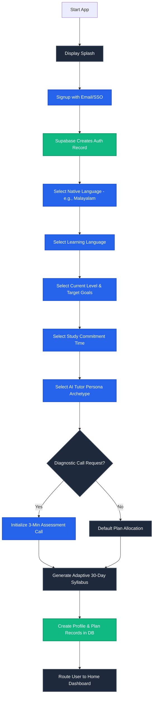
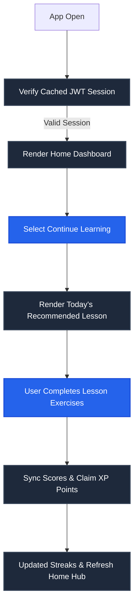
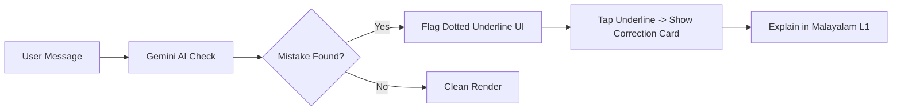
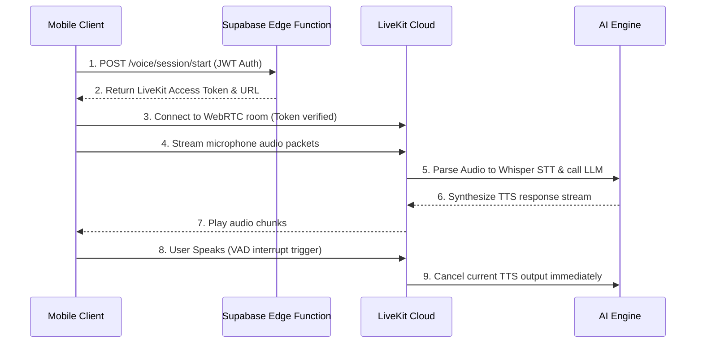
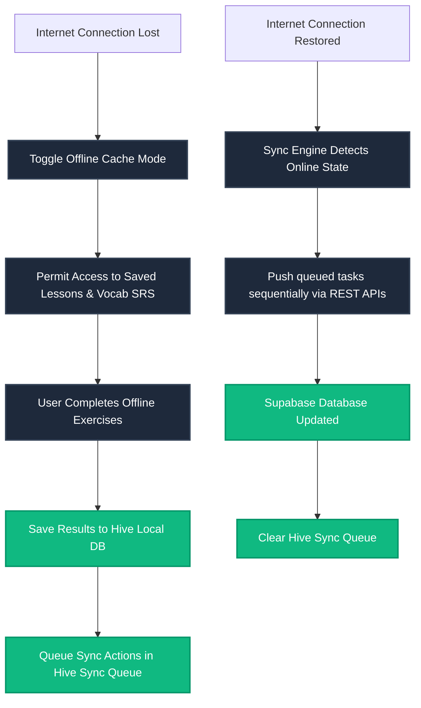

# User Flow Documentation: AI Language Coach
**Version:** 1.0  
**Status:** Draft  
**Target Clients:** iOS & Android Mobile Apps  
**Last Updated:** July 2026  

---

## 1. Purpose
This document defines every primary user journey, interface transition state, database synchronizing check, and error recovery sequence within **AI Language Coach**. 

The goal is to create a frictionless, predictable user experience that aligns with Material 3 navigation guidelines and maintains high retention rates.

---

## 2. Main Navigation Hierarchy
Upon opening the application, the system inspects the cached session state:

```text
[Splash Screen] ---> Checks local session JWT
                        |
                        +---> [Token Missing/Expired] ---> [Auth Screen (Login/Signup)]
                        |                                       |
                        |                                       +---> [Onboarding Wizard]
                        |
                        +---> [Token Valid] -------------> [Home Dashboard (Shell Layout)]
                                                                |
         +--------------------+-------------------+-------------+--------------+
         |                    |                   |                            |
    [Home Hub]           [Practice]          [Progress]                 [Achievements]
    - Today's Task       - Lessons           - Error logs               - Badges matrix
    - Streaks            - Writing essays    - Exam score predictions   - Leaderboards
    - Voice Call (FAB)   - Timed exams       - Weekly report charts     - Shared cards
```

---

## 3. First-Time Registration & Onboarding Flow

This flow handles new account creation, goal setting, diagnostic testing, and baseline study plan configuration.



---

## 4. Returning User Session Flow



---

## 5. AI Chat & Grammar Correction Flow

*   **Message Dispatch:** User inputs text and clicks send. The message is rendered in the chat view instantly.
*   **Correction Logic:** Messages are analyzed asynchronously. If a grammar mistake is detected:
    1.  The system underlines the error in the chat bubble.
    2.  Tapping the card opens a slide-up sheet displaying the original text, corrected text, an explanation, and Malayalam translations.
*   **Message Save:** Save message transactions to the PostgreSQL `messages` table.



---

## 6. Voice Call Handshake Flow (LiveKit)

1.  **Request Session:** User clicks the FAB. The client sends a request to `/voice/session/start`.
2.  **Establish RTC:** Supabase Edge Function generates an access token and returns LiveKit server coordinates.
3.  **Live Stream:** The client connects to the LiveKit server using WebSockets, initializing WebRTC audio streams.
4.  **VAD Interruption:** If user speech is detected while the AI is outputting TTS, the client sends a cancel signal to stop AI audio play immediately.
5.  **Clean Termination:** User clicks the "End Call" button. The client terminates the WebRTC session, uploads logs, and shows summary reviews.



---

## 7. Grammar Correction Flow
*   **User Action:** User inputs target sentence: *"Yesterday I go school."*
*   **AI Process:** Parse grammar tokens. Detect past tense simple irregularities.
*   **UI Response:** Show correction cards:
    *   *Correction:* *"Yesterday I went to school."*
    *   *Malayalam Scaffold:* *"കഴിഞ്ഞുപോയ കാര്യങ്ങൾ പറയാൻ 'went' എന്ന ഭൂതകാല രൂപമാണ് ഉപയോഗിക്കേണ്ടത്."*
*   **Practice Loop:** Present a quick 1-sentence exercise matching the rule. Update grammar progress charts.

---

## 8. Translation & L1 Scaffolding Flow
*   **Activation:** Double-tapping any text in the app triggers a translation overlay.
*   **Malayalam Explanations:** The system uses the selected native language (L1) to explain complex grammatical rules.
*   **Immersion Shift (Decay):** As user vocabulary and grammar scores increase, the system automatically reduces L1 translations by 15% per level, shifting toward total target language immersion.

---

## 9. Vocabulary SRS Loop
*   **Agenda Generation:** Tapping "Vocabulary" fetches today's queue from the local Hive database.
*   **Spaced Repetition Review:**
    1.  Show card front (word, audio play button).
    2.  User taps to flip, displaying meaning, Malayalam translation, and examples.
    3.  User selects mastery rating: **Hard** (Review in 1 day), **Good** (Review in 4 days), **Easy** (Review in 10 days).
    4.  Update next review timestamps in the database.

---

## 10. Reading practice Flow
*   **Material Selection:** Select an article or mock academic text matching target exam requirements.
*   **Interactive Passage Reading:** User reads passage. Long-pressing any word overlays definitions and Malayalam translations.
*   **Quiz Check:** Complete multiple-choice questions. Score metrics, reading speed (WPM), and completion status are updated in the database.

---

## 11. Listening practice Flow
*   **Lesson Start:** Load audio mock conversation or podcast.
*   **Speed & Audio controls:** Stream audio via standard media players. Allow users to adjust speech rates dynamically (0.75x to 1.25x).
*   **Evaluation:** Complete comprehension questions. Grade responses instantly, and sync listening stats to the dashboard.

---

## 12. Writing Evaluation Flow
*   **Task Setup:** User selects an essay topic and enters their submission in the text box.
*   **Submission Action:** Click "Submit Essay". The client calls `/writing/evaluate` with the text payload.
*   **AI Evaluation:** Run evaluation prompts assessing: Grammar, Vocabulary, Coherence, and Task Achievement.
*   **Detailed Feedback:** Render estimated band score, highlights of grammar mistakes, and rewrite recommendations. Save results to exam history logs.

---

## 13. Speaking Mock Exam Flow
*   **Lockdown Setup:** User starts a mock exam. The system locks page navigation and disables pause triggers.
*   **Structured Interview:**
    *   *Section 1:* Small talk questions (Q&A format).
    *   *Section 2:* Cue card presentation (1-min prep / 2-min talk).
    *   *Section 3:* Abstract discussion (related questions).
*   **Score Delivery:** Process recording logs to output bands/CEFR scores, pronunciation clarity charts, and study plan recommendations.

---

## 14. Daily Learning Flow
1.  **Open App:** The home screen displays today's study goal and tasks (e.g., Vocab SRS, Speaking call).
2.  **Complete Tasks:** User clicks and completes daily tasks, earning XP points for each session.
3.  **Claim Rewards:** Once the daily goal timer completes, show streak unlock animations and update database records.

---

## 15. Weekly Report Flow
1.  **Compile Statistics:** At the end of each week, a background function aggregates study times, scores, and mistakes.
2.  **Generate AI Summary:** Call Gemini API to write a personalized weekly improvement report.
3.  **User Notification:** Trigger an FCM push notification: *"Your weekly progress report is ready!"*
4.  **Display Report:** Open weekly report card dashboards featuring sharing shortcuts.

---

## 16. Achievement Unlock Flow
*   **Unlocking Actions:** User completes lesson milestone or streak count.
*   **Check Requirements:** Supabase trigger checks achievement rules. If requirements are met, flag the achievement as unlocked.
*   **UI Celebration:** Render popups with haptic feedback, play congratulatory sounds, and show confetti animations.

---

## 17. Streak Maintenance Flow
*   **Daily Log:** User completes their first study task of the day.
*   **Consecutive Check:** Supabase updates the user's active streak count.
*   **Streak Freeze Option:** If a user misses a day but has a "Streak Freeze" item cached, consume it to protect their streak.

---

## 18. Subscription Purchase Flow
*   **Gating Trigger:** Free user exceeds daily limits or attempts to access premium mock exams.
*   **Paywall Display:** Present plan comparison cards (Free vs. Premium).
*   **In-App Purchase:** User completes purchase via Apple App Store or Google Play Store.
*   **Verification:** Call `/subscription/purchase` with transaction receipts.
*   **Activation:** Supabase confirms payment with billing services and updates account capabilities instantly.

---

## 19. AI Memory Extraction Flow
1.  **Session Terminated:** A text or voice conversation ends.
2.  **Metadata Extraction:** Deno Edge Functions parse the transcript text to extract user interests, frequent grammar mistakes, and weak vocabulary.
3.  **Graph Update:** Update PostgreSQL vector databases with the new user context.
4.  **Prompt Injection:** Retrieve this context and inject it into the system prompt of future voice/text sessions to customize dialogues.

---

## 20. Offline Cache & Sync Flow

Handles local progress caching and background database synchronization when network connectivity drops.



---

## 21. Error Recovery Flow
*   **API Timeouts:** If an API request fails, retry the request automatically (up to 3 times, using exponential backoff).
*   **Graceful Degradation:** If the backend connection still fails, display an error view with explanations and retry buttons, while routing users to offline features (like vocabulary drills).

---

## 22. Settings & GDPR Cascading Deletion Flow
1.  **Delete Account:** User clicks "Delete Account" in the settings profile.
2.  **Double Confirmation:** Show a confirmation warning detailing permanent data loss.
3.  **Trigger Wiping:** Call `/profile/delete`. Supabase processes secure database deletion rules, removing user accounts, profile details, transaction records, and saved voice files within 72 hours.

---

## 23. Edge-Case User Journey Mitigations

### 23.1 User closes app during an active Voice Call
*   **System Check:** LiveKit detects socket closure within 3 seconds.
*   **Server Cleanup:** The server halts active TTS stream generators, saves the conversation transcript up to the point of disconnection, and updates the database to prevent token leaks.
*   **Client Restore:** Upon restart, the client app detects the unfinished session, closes the call window, and displays the saved transcript summary.

### 23.2 Network Interruption during Voice Stream
*   **UI Alert:** The voice call screen displays a "Reconnecting..." indicator with haptic alerts.
*   **Auto-reconnect:** The LiveKit client attempts to reconnect for 10 seconds.
*   **Graceful Exit:** If reconnection fails after 10 seconds, the app terminates the call session, saves the transcript locally, and shows the summary review deck.

### 23.3 Audio Permission Denied
*   **UI Check:** Request audio recording permission before launching voice calls.
*   **Mitigation Flow:** If the permission is denied, block voice features and display dialog sheets guiding users on how to enable microphone permissions in their device settings.

---

## 24. UX Principles
*   **<3 Taps to Practice:** Users must be able to start speaking drills or quizzes from the home screen in under 3 taps.
*   **Auto-Save Progress:** Always save lesson progress locally to prevent data loss from sudden app closures.
*   **Predictable Navigation:** Navigation structures must adhere strictly to standard iOS and Android patterns.

---

## 25. User Flow Verification Checklist

Validate flows against this checklist before production release:
*   [ ] Does the onboarding wizard redirect users to onboarding step 1 if incomplete?
*   [ ] Does LiveKit voice calls terminate gracefully upon network dropouts?
*   [ ] Has offline queue synchronization been tested under simulated packet loss?
*   [ ] Do empty screen states feature an illustration and a clear call-to-action (CTA)?
*   [ ] Does the GDPR deletion flow execute cascading database drops across all tables?
*   [ ] Are microphone permission denials handled gracefully without app crashes?
