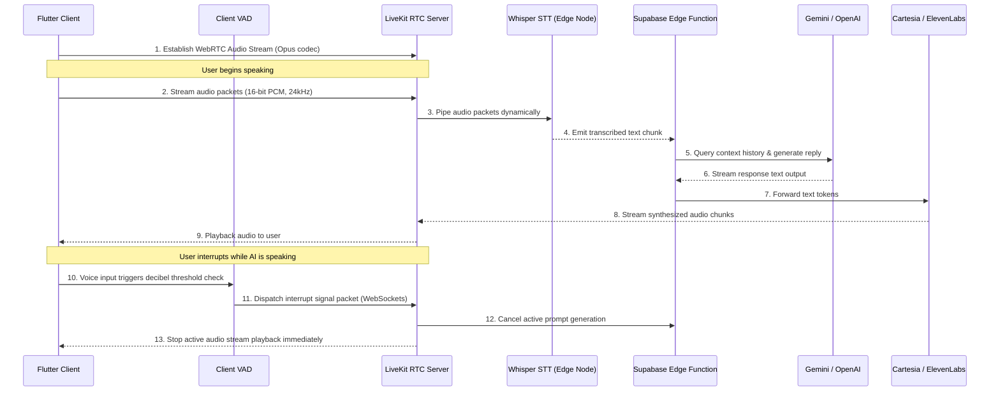
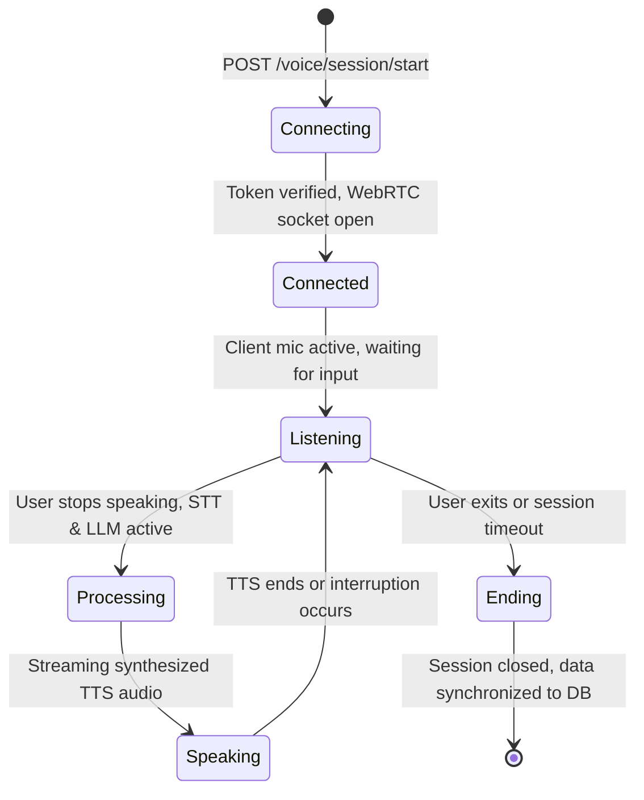

# Voice Architecture Document: AI Language Coach
**Version:** 1.0  
**Status:** Draft  
**Core Technologies:** LiveKit Cloud, WebRTC, WebSockets, Whisper, Cartesia TTS  
**Last Updated:** July 2026  

---

## 1. Purpose
This document defines the real-time voice call architecture for **AI Language Coach**. It outlines media transport layers, audio processing configurations, text-to-speech (TTS) and speech-to-text (STT) integrations, latency targets, and interruption handling to guarantee fluid, natural conversations that mimic human tutor interactions.

---

## 2. Real-Time Voice Objectives
*   **Conversation Flow:** Enable hands-free, natural conversations without push-to-talk delays.
*   **Latency Target:** Maintain an end-to-end voice loop latency of **under 800 milliseconds** (Targeting sub-500ms).
*   **Barge-In (Interruption):** Halt active synthesized audio streams immediately when user speech is detected.
*   **Audio Robustness:** Implement noise cancellation and automatic recovery on network drops.

---

## 3. High-Level Voice Pipeline Sequence

This diagram maps the routing of voice packets from the user's speech to the AI's spoken response:



---

## 4. Subsystem Components

*   **Flutter Mobile Client:** Captures microphone audio using the `flutter_sound` or `record` packages. Runs local VAD checks and plays back streamed audio using WebRTC nodes.
*   **LiveKit Cloud Server:** Manages low-latency media transport, audio routing, WebSockets channels, and handles reconnect handshakes during signal drops.
*   **Whisper STT Service:** Translates incoming audio streams into text. Supports partial transcripts to decrease conversational lag.
*   **Supabase Edge Functions:** Serves as the orchestrator. Validates sessions, manages conversation histories, formats LLM prompts, and handles the API connections between STT, LLM, and TTS providers.
*   **Cartesia / ElevenLabs (TTS):** Streams synthesized voice audio back to the LiveKit server in chunks as soon as the first sentence is generated by the LLM.

---

## 5. Voice Session Lifecycle States

The voice connection transitions through the following state machine:



---

## 6. AI Tutor Voice Personas

Tutor voice profiles are optimized to match the target CEFR learning tiers:
*   **Emma (ESL Tutor):** Warm, clear voice profile, paced at **100 WPM** to support intermediate learners.
*   **David (IELTS Examiner):** Formal, British English accent, paced at **130 WPM** to simulate official IELTS exam environments.
*   **Sophia (German Coach):** Structured German voice profile, paced at **90 WPM** with precise enunciation of grammatical case endings.
*   **Alex (Conversationalist):** Natural speed, paced at **140 WPM** with informal speaking styles.

---

## 7. Interruption Handling (Barge-In)
*   **Threshold:** Client-side VAD monitors microphone inputs. If signal levels exceed **-26dB** for longer than **200ms**, the client flags active user speech.
*   **Execution:** The client dispatches an interruption signal via the LiveKit WebSocket channel. The server immediately terminates LLM generation, drops current TTS audio streams, and shifts the session state back to "Listening".

---

## 8. Latency Budget Allocations

To target sub-second response loop times, each pipeline step must conform to the following budgets:

```
+-----------------------------------+-----------------------------------+---------------------------+
| PIPELINE OPERATION                | TARGET LATENCY (ms)               | MAXIMUM SLA LIMIT (ms)    |
+-----------------------------------+-----------------------------------+---------------------------+
| Client Audio Recording Buffer     | 40ms                              | 100ms                     |
+-----------------------------------+-----------------------------------+---------------------------+
| Network Transport (WebRTC)        | 80ms                              | 200ms                     |
+-----------------------------------+-----------------------------------+---------------------------+
| Whisper STT Transcription         | 150ms                             | 300ms                     |
+-----------------------------------+-----------------------------------+---------------------------+
| LLM Orchestration & Prompting     | 300ms                             | 800ms                     |
+-----------------------------------+-----------------------------------+---------------------------+
| TTS Audio Chunk Synthesis         | 180ms                             | 400ms                     |
+-----------------------------------+-----------------------------------+---------------------------+
| Playback Start                    | 50ms                              | 100ms                     |
+-----------------------------------+-----------------------------------+---------------------------+
| End-to-End Loop Target            | 800ms                             | 1,900ms                   |
+-----------------------------------+-----------------------------------+---------------------------+
```

---

## 9. Audio Engineering Specifications
*   **Sample Rate:** **24kHz** standard (supporting high-clarity pronunciation analysis), falling back to **16kHz** on low-bandwidth networks.
*   **Codec:** **Opus** (constant bitrate, optimized for real-time voice streaming).
*   **WebRTC Constraints:**
    *   `EchoCancellation`: Enforced (Client-side hardware-assisted).
    *   `NoiseSuppression`: Enforced (Filtering background room humming).
    *   `AutoGainControl`: Enforced (Normalizing quiet voices).

---

## 10. Supported Languages & Accents
*   **Phase 1 (MVP):** English (Standard US, British, and Australian accents) and German.
*   **Phase 2:** French, Spanish, and Malayalam (used for native scaffolding translations).
*   **Future:** Japanese, Korean, Arabic, and Italian.

---

## 11. Pronunciation Diagnostic Engine
The voice pipeline processes the user's spoken audio payload using speech diagnostic models to score oral performance:
*   **Clarity Metrics:** Compare spoken phonemes against native pronunciation models to identify errors.
*   **Fluency Metrics:** Analyze hesitation patterns, pauses, and speech rates (WPM).
*   **Prosody Metrics:** Evaluate syllable stress and sentence-level intonation curves.

---

## 12. Conversation Context Management
During active voice sessions, the orchestrator caches the last 5 turns of conversation in memory to maintain context. It pulls biographical facts (interests, goals) and target exam profiles from the database to personalize the AI's prompts.

---

## 13. Database Telemetry Log Schema
Every completed voice session logs metadata to the PostgreSQL `voice_sessions` table:
```json
{
  "session_id": "f8a02c89-612a-43d9-a4c3-1d0b0aef8a09",
  "user_id": "c3b9b124-7622-48ea-8b4b-9d414e21f92e",
  "duration_seconds": 320,
  "average_latency_ms": 480,
  "provider": "Cartesia",
  "overall_score": 85,
  "transcript_text": "Conversation transcript content...",
  "cost_estimate": 0.045000
}
```

---

## 14. Error Recovery Paths

*   **Socket Disconnections:** LiveKit client will attempt to reconnect automatically for 10 seconds before returning a failure.
*   **API Timeouts:** If the primary TTS API fails, the application dynamically falls back to the device's native system Text-to-Speech library.
*   **Graceful Exit:** If a reconnection attempt fails, the app terminates the call session, saves the transcript locally, and shows the summary review deck.

---

## 15. Security & Cryptography Standards
*   **Media Encryption:** Voice streams are encrypted in transit using Secure Real-Time Transport Protocol (SRTP).
*   **Token Verification:** Access to LiveKit channels requires a secure token containing the user's ID, with a lifespan limited to the duration of the call session (maximum 60 minutes).
*   **API Security:** All API keys are stored securely on the backend, hidden from client-side code.

---

## 16. Cost Optimization Strategy
*   **Lower-Cost Models:** Route simple conversational turns to cost-effective models (e.g., Gemini Flash), reserving premium models (OpenAI GPT-4o) for complex mock exam evaluations.
*   **Audio Buffering:** Buffer voice packets client-side in 40ms blocks to optimize network transmission overhead.
*   **Usage Gating:** Limit free tier voice sessions to 5 minutes per day to control API expenses.

---

## 17. Accessibility & Offline Settings
*   **Live Subtitles:** Provide real-time transcripts on the screen for users with hearing impairments.
*   **Adjustable Playback:** Users can adjust the playback rate of the AI tutor's voice dynamically from 0.75x to 1.25x.
*   **Offline Mode:** Keep voice call features disabled when offline, redirecting users to cached text-based exercises.

---

## 18. Future Architectural Extensions
*   **Emotion Detection:** Analyze pitch variance to detect user hesitation or frustration, dynamically prompting the AI tutor to slow down or offer encouragement.
*   **Accent Coaching:** Match pronunciation evaluations against specific regional accents (e.g., British RP vs. General American).

---

## 19. Voice Quality Checklist

Verify voice features against this checklist before production release:
*   [ ] Does the end-to-end voice loop latency remain under 800ms?
*   [ ] Does the client-side VAD trigger interruption signals within 200ms of user speech?
*   [ ] Does the system fall back to native device TTS if the primary API fails?
*   [ ] Are WebRTC audio streams encrypted using SRTP?
*   [ ] Does the LiveKit client attempt to reconnect automatically during network drops?
*   [ ] Have pronunciation diagnostics been calibrated against standard audio samples?
*   [ ] Are session tokens restricted to a maximum lifespan of 60 minutes?
