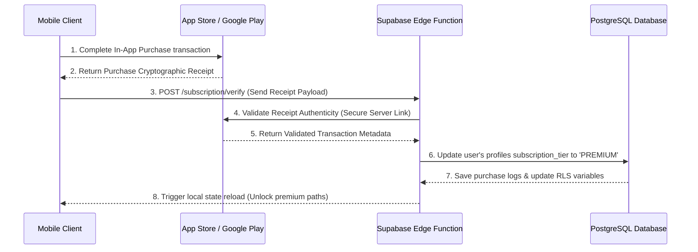

# Monetization & Subscription Document: AI Language Coach
**Version:** 1.0  
**Status:** Draft  
**Billing Integrations:** Apple App Store In-App Purchases, Google Play Billing, Stripe Webhooks  
**Last Updated:** July 2026  

---

## 1. Purpose
This document defines the revenue strategy, subscription tiers, regional pricing matrices, database usage quota structures, billing integration flows, and unit economics cost models for **AI Language Coach**. 

It ensures a sustainable monetization flow that supports high-retention learning pathways while maintaining positive margins against real-time AI and media streaming infrastructure expenses.

---

## 2. Freemium SaaS Strategy

The monetization framework relies on a tiered Freemium SaaS architecture, allowing users to experience conversational language learning while gating intensive AI actions behind subscription tiers:

```
                  [ B2B Institution Portal ]
                  - Reporting tools, student grids
                  - Pricing based on active student seat volume
         --------------------------------------------------
         [ Premium+ Plan: US$19.99/mo ]
         - Unlimited real-time voice minutes
         - Advanced speaking intonation reviews
         - Premium voice personas & exam simulator keys
    ----------------------------------------------------------
    [ Premium Plan: US$9.99/mo ]
    - Unlimited text chat, 120 speaking minutes/day
    - Personalized study agendas, RAG memory caches
------------------------------------------------------------------
[ Free Plan: US$0.00/mo ]
- 50 messages/day, 10 voice minutes/day, 1 mock exam/week
```

---

## 3. Subscription Plan Specifications

```
+---------------------------+---------------------------+---------------------------+---------------------------+
| CONSTRAINT PARAMETER      | FREE PLAN                 | PREMIUM PLAN              | PREMIUM+ PLAN             |
+---------------------------+---------------------------+---------------------------+---------------------------+
| Monthly Price (Illust.)   | US$0.00                   | US$9.99                   | US$19.99                  |
+---------------------------+---------------------------+---------------------------+---------------------------+
| Annual Price (Illust.)    | N/A                       | US$79.99                  | US$159.99                 |
+---------------------------+---------------------------+---------------------------+---------------------------+
| Daily Chat Messages       | 50 messages               | Unlimited (Fair usage)    | Unlimited                 |
+---------------------------+---------------------------+---------------------------+---------------------------+
| Daily Voice Call Limit    | 10 minutes                | 120 minutes               | Unlimited                 |
+---------------------------+---------------------------+---------------------------+---------------------------+
| Daily Grammar Corrections | 5 checks                  | Unlimited                 | Unlimited                 |
+---------------------------+---------------------------+---------------------------+---------------------------+
| Daily Writing Evaluation  | 2 reviews                 | Unlimited                 | Unlimited                 |
+---------------------------+---------------------------+---------------------------+---------------------------+
| Mock Exams Gating         | 1 mock exam per week      | Full access               | Full access + custom keys |
+---------------------------+---------------------------+---------------------------+---------------------------+
| AI RAG Memory Size        | 10 context facts          | Unlimited                 | Unlimited                 |
+---------------------------+---------------------------+---------------------------+---------------------------+
| Regional Pricing (PPP)    | Supported                 | Supported                 | Supported                 |
+---------------------------+---------------------------+---------------------------+---------------------------+
```

---

## 4. Localized Regional Pricing (Purchasing Power Parity)

To support global growth, pricing is adjusted to match localized purchasing power parity:

```
+-------------------+-------------------+-------------------+-------------------+-----------------------+
| TARGET MARKET     | CURRENCY          | FREE PLAN         | PREMIUM MONTHLY   | PREMIUM+ MONTHLY      |
+-------------------+-------------------+-------------------+-------------------+-----------------------+
| United States     | USD ($)           | $0.00             | $9.99             | $19.99                |
+-------------------+-------------------+-------------------+-------------------+-----------------------+
| European Union    | EUR (€)           | €0.00             | €9.99             | €19.99                |
+-------------------+-------------------+-------------------+-------------------+-----------------------+
| India             | INR (₹)           | ₹0.00             | ₹299.00           | ₹599.00               |
+-------------------+-------------------+-------------------+-------------------+-----------------------+
| Southeast Asia    | SGD ($)           | $0.00             | $12.99            | $24.99                |
+-------------------+-------------------+-------------------+-------------------+-----------------------+
| United Kingdom    | GBP (£)           | £0.00             | £8.99             | £17.99                |
+-------------------+-------------------+-------------------+-------------------+-----------------------+
```

---

## 5. Database Usage Quota Enforcements DDL

The database monitors user resource consumption in real-time, blocking Edge Function requests if quotas are exceeded:

```sql
-- DDL for tracking daily user quotas
CREATE TABLE user_quotas (
    id UUID PRIMARY KEY DEFAULT gen_random_uuid(),
    user_id UUID REFERENCES profiles(user_id) ON DELETE CASCADE UNIQUE,
    messages_sent_today INTEGER DEFAULT 0,
    voice_minutes_today NUMERIC(5,2) DEFAULT 0.00,
    grammar_checks_today INTEGER DEFAULT 0,
    writing_evals_today INTEGER DEFAULT 0,
    last_reset_at TIMESTAMPTZ DEFAULT NOW()
);

-- Trigger function to check message quota before inserting into messages
CREATE OR REPLACE FUNCTION verify_message_quota()
RETURNS TRIGGER AS $$
DECLARE
    v_user_tier VARCHAR(20);
    v_messages_today INTEGER;
    v_limit INTEGER;
BEGIN
    -- Fetch the user's subscription tier
    SELECT subscription_tier INTO v_user_tier FROM profiles WHERE user_id = NEW.sender_id;
    
    -- Free tier limits enforce 50 messages
    IF v_user_tier = 'FREE' THEN
        v_limit := 50;
    ELSE
        RETURN NEW; -- Skip checks for paying members
    END IF;

    -- Fetch current usage count
    SELECT messages_sent_today INTO v_messages_today FROM user_quotas WHERE user_id = NEW.sender_id;

    IF v_messages_today >= v_limit THEN
        RAISE EXCEPTION 'USER_QUOTA_EXCEEDED: Daily message limit of % has been reached.', v_limit;
    END IF;

    -- Increment usage count
    UPDATE user_quotas 
    SET messages_sent_today = messages_sent_today + 1 
    WHERE user_id = NEW.sender_id;

    RETURN NEW;
END;
$$ LANGUAGE plpgsql;
```

---

## 6. Purchase Webhooks Verification Flow

The billing pipeline uses webhooks to process and verify in-app purchases:



---

## 7. Add-On Consumable Purchases
Users can purchase individual add-on keys to unlock extra practice minutes or mock exams without upgrading their plan:
*   *Mock IELTS Speaking Exam Key:* **US$2.99** per attempt (includes detailed scoring and feedback).
*   *Extra Speaking Minutes:* **US$1.99** for 60 additional real-time voice minutes.
*   *Premium Tutor Voice Pack:* **US$4.99** to unlock advanced AI voices.

---

## 8. Growth Referral Program Mechanics
To drive organic growth, the application integrates a double-sided referral incentive loop:
1.  User shares their unique referral link.
2.  A new user signs up using the link.
3.  Upon the new user's first subscription payment:
    *   *Referrer receives:* 14 days of Premium tier access and +500 XP points.
    *   *Referee receives:* 14 days of Premium tier access and a "Referral Starter" profile badge.

---

## 9. Unit Economics & Inference Cost Metrics

To ensure profitability, subscription pricing is modeled against AI infrastructure costs (estimating average daily usage of 30 conversational turns):

```
+-----------------------------------+-----------------------------------+---------------------------+
| AI OPERATION TYPE                 | METRIC UNIT COST RATE             | AVERAGE DAILY COST PER    |
|                                   |                                   | USER (30 turns)           |
+-----------------------------------+-----------------------------------+---------------------------+
| Whisper STT                       | $0.006 / minute                   | $0.09                     |
+-----------------------------------+-----------------------------------+---------------------------+
| Gemini 1.5 Flash (Grammar/Chat)   | $0.075 / 1M tokens                | $0.015                    |
+-----------------------------------+-----------------------------------+---------------------------+
| Cartesia TTS (Real-time Audio)    | $0.05 / 1M characters             | $0.08                     |
+-----------------------------------+-----------------------------------+---------------------------+
| LiveKit WebRTC Transport          | $0.004 / GB bandwidth             | $0.005                    |
+-----------------------------------+-----------------------------------+---------------------------+
| Total Infrastructure Cost         | N/A                               | $0.190                    |
+-----------------------------------+-----------------------------------+---------------------------+
```
*   **Monthly Infrastructure Cost per Active User:** Approx. **US$5.70**.
*   **Premium Subscription Pricing (US):** **US$9.99/month**.
*   **Gross Profit Margin Target:** **>40%** for Premium tier users.

---

## 10. Financial Performance Indicators (KPIs)
*   **Premium Conversion Rate:** Target conversion of **>5%** from free to paid tiers.
*   **Monthly Churn Target:** Maintain churn rates of **<5%** to ensure customer lifetime value (LTV).
*   **LTV to CAC Ratio:** Target an LTV to CAC ratio of **>3:1** to optimize acquisition costs.

---

## 11. Monetization Implementation Checklist

Verify the monetization setup against this checklist before production release:
*   [ ] Do purchase transactions execute successfully in Android and iOS sandbox environments?
*   [ ] Does the database quota trigger block edge calls when user limits are exceeded?
*   [ ] Have Stripe and App Store webhook verification endpoints been secured against spoofing?
*   [ ] Are billing logs stored in the audit trail without exposing credit card details?
*   [ ] Have localized pricing tiers been tested across different regional networks?
*   [ ] Does tapping "Restore Purchases" sync active app store subscriptions with Supabase?
*   [ ] Are the unit economics projections updated to reflect the latest model provider pricing?
