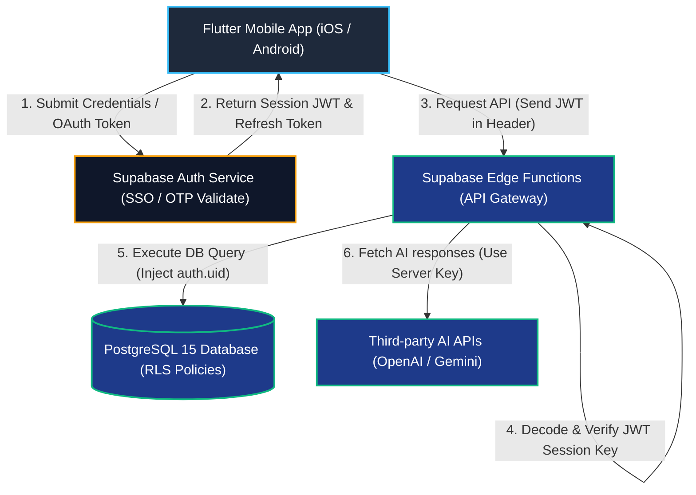

# Authentication & Security Document: AI Language Coach
**Version:** 1.0  
**Status:** Draft  
**Standard Protocols:** JWT, OAuth 2.0, WebRTC SRTP, TLS 1.3, AES-256  
**Last Updated:** July 2026  

---

## 1. Purpose
This document defines the security architecture, authentication mechanisms, authorization controls, data protection configurations, and regulatory compliance standards for the **AI Language Coach** platform. 

It serves as the definitive security specification to protect user privacy, secure AI pipelines, prevent platform abuse, and ensure production readiness.

---

## 2. Core Security Principles
AI Language Coach is designed around the following architectural security principles:
*   **Zero Trust:** Authenticate and authorize every request explicitly. Never trust the client application implicitly.
*   **Least Privilege:** Restrict user and process database permissions to only the records necessary for their immediate task.
*   **Secure by Default:** Enforce security policies by default (e.g., PostgreSQL Row-Level Security active on all tables).
*   **Privacy by Design:** Strip personally identifiable information (PII) from log files and analytics payloads.
*   **Principle of Minimal Data Collection:** Do not collect user credentials or profile records beyond what is required to deliver customized language coaching.

---

## 3. Authentication Architecture

The system uses a decentralized authentication model powered by Supabase Auth, returning stateless JSON Web Tokens (JWT) for API request validation:



---

## 4. Supported Authentication Methods
*   **Phase 1 (MVP Launch):**
    *   *Email & Password:* Standard email signups with verified verification links.
    *   *Google SSO:* Native sign-in integration on Android and iOS.
    *   *Apple Sign-In:* Native sign-in integration on iOS devices.
*   **Future Phases:**
    *   *Microsoft SSO:* For corporate and university integrations.
    *   *Anonymous Guest Mode:* Anonymous local cached profile sessions (automatically converted to full accounts upon signup).

---

## 5. Session Lifecycle & JWT Administration
*   **JWT Access Token Lifespan:** Access tokens expire exactly **60 minutes** after issuance.
*   **Refresh Token Rotation:** Refresh tokens are rotated automatically. The client submits a refresh token via secure HTTPS channels to obtain a new JWT and an updated refresh token.
*   **Revocation Flow:** When a user logs out, the client notifies Supabase Auth, which immediately revokes active refresh tokens and invalidates the session in the database.

---

## 6. Database Authorization & Row-Level Security (RLS)

Every table containing user-owned data must enable Row-Level Security (RLS). Database queries are evaluated against the requesting user's Supabase JWT UUID (`auth.uid()`).

```sql
-- Enforce RLS on core user tables

-- 1. Profiles Table Policies
ALTER TABLE profiles ENABLE ROW LEVEL SECURITY;

CREATE POLICY "Enable read access for own profile only"
ON profiles FOR SELECT
USING (auth.uid() = user_id);

CREATE POLICY "Enable update access for own profile only"
ON profiles FOR UPDATE
USING (auth.uid() = user_id);

-- 2. Messages Table Policies
ALTER TABLE messages ENABLE ROW LEVEL SECURITY;

CREATE POLICY "Enable CRUD operations for own conversation messages"
ON messages FOR ALL
USING (
  EXISTS (
    SELECT 1 FROM conversations 
    WHERE conversations.id = messages.conversation_id 
    AND conversations.user_id = auth.uid()
  )
);
```

---

## 7. Secrets Storage & API Gateway Key Management

Mobile applications must never store third-party API credentials (like Gemini or OpenAI keys). All keys are managed securely on the backend:

```
  [Flutter Mobile Client]
            |
            | (Request to Supabase Edge Function)
            v
  [Supabase Edge Function (Deno Sandbox)]
            |
            | (Read Env Secret: Deno.env.get("OPENAI_API_KEY"))
            v
  [Supabase Secrets Vault]
            |
            v
  [Forward authenticated request to AI Provider]
```

### Secrets Vault Configurations:
*   Secrets are injected into Supabase Edge Functions using the CLI dashboard. They are never committed to the Git repository.
*   Secrets include: `OPENAI_API_KEY`, `GEMINI_API_KEY`, `LIVEKIT_API_SECRET`, and payment provider credentials.

---

## 8. Secure Storage on Mobile Devices

The mobile client caches session tokens locally using encrypted storage mechanisms:
*   **Android:** EncryptedSharedPreferences (integrated with the hardware-backed Android Keystore system).
*   **iOS:** Keychain Services API.
*   **Implementation Library:** `flutter_secure_storage` package configured with strict encryption options:
    ```dart
    final storage = const FlutterSecureStorage(
      aOptions: AndroidOptions(encryptedSharedPreferences: true),
      iOptions: IOSOptions(accessibility: KeychainAccessibility.first_unlock),
    );
    ```

---

## 9. Encryption Standards
*   **Data In-Transit:** Enforce TLS 1.3 (with TLS 1.2 as a minimum fallback) for all HTTPS and WebSockets traffic.
*   **Data At-Rest:** Supabase PostgreSQL databases and Storage objects use AES-256 transparent encryption at the storage block layer.
*   **Real-time Media:** LiveKit audio WebRTC streams are encrypted in transit using Secure Real-Time Transport Protocol (SRTP).

---

## 10. Password & Validation Policies

*   **Password Policy:** Passwords must meet these minimum requirements:
    *   At least 8 characters in length.
    *   Contains at least one uppercase letter, one lowercase letter, one number, and one special character.
*   **Input Validation:** Sanitize input strings on Deno Edge Functions using regular expression filters to prevent SQL injection or cross-site scripting:
    *   *Email RegExp:* `^[a-zA-Z0-9._%+-]+@[a-zA-Z0-9.-]+\.[a-zA-Z]{2,}$`
    *   *Prompt Sanitization:* Scan user prompts to filter out common prompt injection phrases (e.g., "Ignore previous system guidelines").

---

## 11. File Upload Security (Supabase Storage)
*   **File Size Gating:**
    *   Profile Images: Maximum **2MB**.
    *   Audio spoken packets: Maximum **10MB** per session file.
*   **MIME Type Restrictions:**
    *   Images: Enforce `.jpg`, `.jpeg`, or `.png` validation checks.
    *   Audio: Enforce `.wav`, `.m4a`, or `.mp3` constraints.
*   **Execution Prevention:** The upload bucket restricts executables or script run actions.

---

## 12. Rate Limiting & Abuse Prevention
*   **Free Plan Gating:** Enforce daily limits:
    *   Maximum 50 API requests per day.
    *   Maximum 5 minutes of voice calling per day.
*   **IP-Based Rate Limiting:** Supabase API Gateways limit clients to a maximum of **100 requests per minute per IP address** to mitigate Denial of Service (DoS) attacks.
*   **Automated Signup Prevention:** Integrate Google reCAPTCHA during Email/Password signup sequences to prevent bot registrations.

---

## 13. Audit Logging Database Specifications

Database modifications are logged to the PostgreSQL `audit_logs` table:

```sql
CREATE TABLE audit_logs (
    id UUID PRIMARY KEY DEFAULT gen_random_uuid(),
    user_id UUID REFERENCES profiles(user_id) ON DELETE SET NULL,
    action VARCHAR(50) NOT NULL, -- e.g., 'AUTH_LOGIN', 'SUB_PURCHASE'
    table_name VARCHAR(100) NOT NULL,
    old_value JSONB,
    new_value JSONB,
    created_at TIMESTAMPTZ NOT NULL DEFAULT NOW()
);

-- PL/pgSQL Function to log authentication events
CREATE OR REPLACE FUNCTION log_auth_event()
RETURNS TRIGGER AS $$
BEGIN
  INSERT INTO audit_logs (user_id, action, table_name, new_value)
  VALUES (NEW.id, 'AUTH_USER_CREATED', 'auth.users', json_build_object('email', NEW.email));
  RETURN NEW;
END;
$$ LANGUAGE plpgsql SECURITY DEFINER;
```

---

## 14. Regulatory Compliance (GDPR & CCPA)
*   **Right to Erasure (Cascading Deletion):** Wiping account records from the settings panel triggers cascading deletes across database tables and deletes the user's voice files from Supabase Storage within 72 hours.
*   **Right to Portability:** Users can request and download a ZIP file containing their profile history and conversation transcripts in JSON format.
*   **Consent Management:** Require users to check explicit consent boxes during signup to agree to terms of service and analytical tracking.

---

## 15. Security Checklist

Verify security features against this checklist before production release:
*   [ ] Is Row-Level Security (RLS) active on all user-owned database tables?
*   [ ] Are API keys and AI credentials hidden from the client code?
*   [ ] Does the mobile client store JWTs using encrypted Keystore/Keychain databases?
*   [ ] Is TLS 1.3 enforced for all network connections?
*   [ ] Are file uploads restricted by size, extension, and MIME type?
*   [ ] Does the cascading account deletion flow remove all personal user records?
*   [ ] Have rate limits been configured for free plans?
