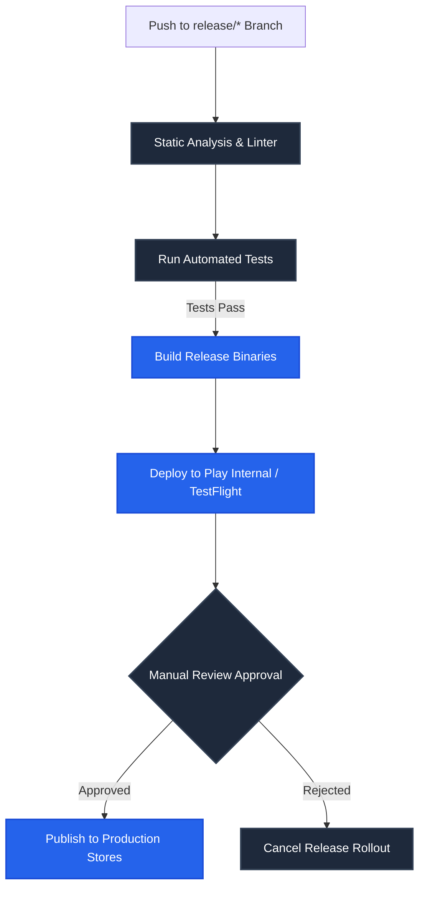

# Deployment & DevOps Guide: AI Language Coach
**Version:** 1.0  
**Status:** Production  
**Automation Systems:** GitHub Actions, Fastlane, Supabase CLI, Firebase CLI  
**Last Updated:** July 2026  

---

## 1. Purpose
This document defines the environment management strategy, configuration variables, compilation commands, third-party service setups, automated CI/CD pipelines, store release checklists, operational monitoring targets, and disaster recovery procedures for **AI Language Coach**.

---

## 2. Environments Strategy

We isolate testing and production changes across three environments:
*   **Development (DEV):** Local Flutter app run in debug mode. Connects to local Supabase CLI instances or test backends.
*   **Staging (STAGE):** Deployed to TestFlight (iOS) and Google Play Internal Testing (Android). Connects to a dedicated STAGE Supabase project with sandbox billing configurations.
*   **Production (PROD):** Deployed to App Store and Google Play. Connects to the primary production Supabase project with active monitoring.

---

## 3. Required Infrastructure Services
*   **Mobile App Framework:** Flutter Stable (Stable).
*   **Backend & DB:** Supabase PostgreSQL 15, Auth, Storage, and Deno Edge Functions.
*   **AI Services Layer:** OpenAI API (GPT-4o) and Google Gemini API (Flash/Pro).
*   **Realtime Audio Streaming:** LiveKit Cloud (WebRTC voice sessions).
*   **Analytics & Push Alerts:** Firebase Analytics, Crashlytics, Cloud Messaging, and PostHog.
*   **Subscriptions & Payments:** RevenueCat and Stripe.

---

## 4. Environment Variables Configuration

We use separate, non-committed `.env` files for each environment:
*   `lib/config/.env.development`
*   `lib/config/.env.staging`
*   `lib/config/.env.production`

### Standard Keys Template:
```text
SUPABASE_URL=https://your_ref.supabase.co
SUPABASE_ANON_KEY=your_public_anon_key
AI_GATEWAY_URL=https://your_ref.supabase.co/functions/v1
LIVEKIT_URL=wss://your_room.livekit.cloud
REVENUECAT_PUBLIC_KEY=rc_public_sdk_key
FIREBASE_APP_ID=your_firebase_app_id
POSTHOG_API_KEY=ph_project_api_key
```
> [!IMPORTANT]
> Never commit `.env` configuration files or raw API keys to Git repositories.

---

## 5. Flutter Compilation Build Commands

Run the following commands to compile release binaries:
*   **Android Release (App Bundle):**
    ```bash
    flutter build appbundle --release --obfuscate --split-debug-info=build/app/outputs/symbols
    ```
*   **iOS Release (IPA Archive):**
    ```bash
    flutter build ipa --release --obfuscate --split-debug-info=build/ios/outputs/symbols
    ```
*   **Web Release:**
    ```bash
    flutter build web --release
    ```

---

## 6. Supabase Deployment CLI Tasks

Manage backend updates using the Supabase CLI:
*   **Apply DB migrations:** `supabase db push --project-ref your_ref`
*   **Deploy all Deno Edge Functions:** `supabase functions deploy --all --project-ref your_ref`
*   **Configure env variables:** `supabase secrets set GEMINI_API_KEY=your_key --project-ref your_ref`

---

## 7. Firebase Services Configurations
*   **Cloud Messaging (FCM):** Configure Android/iOS push certificates. Keep `google-services.json` and `GoogleService-Info.plist` files out of public repositories.
*   **Crashlytics:** Set up automatic symbol uploads inside build configurations to ensure readable stack traces.

---

## 8. LiveKit Voice Setup & Configurations
*   Configure room timeouts (maximum 60-minute duration limits).
*   Set VAD (Voice Activity Detection) parameters in backend Edge Functions to handle interruptions.
*   Run weekly voice tests to verify audio latency remains under the **500ms** target.

---

## 9. RevenueCat Billing Configurations
*   Set up matching products, entitlements, and offerings inside Apple App Store Connect and Google Play Console.
*   **Sandbox Verification:** Test monthly, annual, and restore transactions inside sandbox test loops before promoting configurations.

---

## 10. Automated CI/CD Pipeline Workflow

The GitHub Actions pipeline automates validations:



---

## 11. Store Deployment Checklists

### 11.1 Android Release Checklist
*   [ ] App Bundle (.aab) generated and signed with the production keystore.
*   [ ] Play Console store listings, descriptions, and privacy policy links updated.
*   [ ] Content rating questionnaire completed.
*   [ ] Internal test track validated by QA.

### 11.2 iOS Release Checklist
*   [ ] IPA archive successfully uploaded to App Store Connect.
*   [ ] App provisioning profiles and signing certificates configured in Apple Developer accounts.
*   [ ] TestFlight builds verified.
*   [ ] Privacy manifests and data collection disclosures updated.

---

## 12. Security & Performance SLA Checklist

Before marking deployments as finalized, verify:
*   **Performance Targets:**
    *   [ ] Cold boot app launch time is **under 3 seconds**.
    *   [ ] Average AI response latency is **under 5 seconds** (including model inference).
    *   [ ] Voice call room connection latency is **under 2 seconds**.
    *   [ ] Crash-free sessions rate is **above 99.5%**.
*   **Security Controls:**
    *   [ ] Row-Level Security (RLS) is active on all database tables.
    *   [ ] Transport layers use secure HTTPS/WSS protocols.
    *   [ ] Dynamic inputs are validated to prevent prompt injection.

---

## 13. Rollback & Disaster Recovery Procedures
*   **Rollback Path (App Stores):** If a production build fails, stop the rollout immediately. Promote the previous stable build to App Store Connect or Play Console.
*   **Backend Rollback:** Deploy the previous stable commit using the Supabase CLI:
    ```bash
    supabase functions deploy ai-chat --project-ref your_ref --use-previous
    ```
*   **Database PITR:** If data corruption occurs, restore the database to a stable state using Supabase Point-in-Time Recovery.

---

## 14. Production Launch Checklist

Verify the setup against this checklist before production release:
*   [ ] Are environment variables configured correctly for the production project?
*   [ ] Have database migrations been pushed and verified?
*   [ ] Have RLS policies been validated?
*   [ ] Are API keys and AI credentials stored securely in the Deno vault?
*   [ ] Has subscription processing been tested in sandboxes?
*   [ ] Are Firebase crash reporting and analytics active?
*   [ ] Has Fastlane been configured for automatic metadata updates?
*   [ ] Are backup routines active on production storage buckets?
